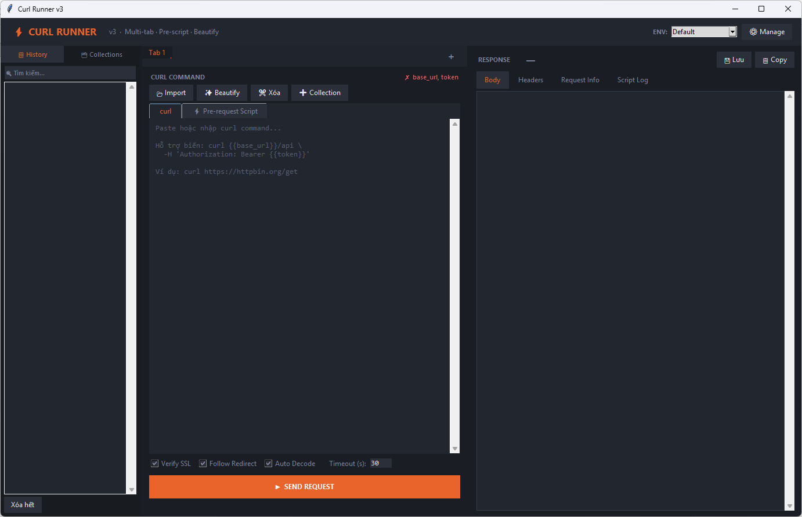

# ⚡ Curl Runner

> Postman trên Desktop — chạy curl command và xem response trực tiếp, không cần cài Postman.


---

## 📸 Screenshot



---

## 📘 User Manual

Xem hướng dẫn chi tiết tại [USER_MANUAL.md](USER_MANUAL.md).

---

## ✨ Tính năng

| Tính năng | Mô tả |
|---|---|
| 🎛 **Modern UI library** | Dùng `ttkbootstrap` để theme Combobox, Notebook, Treeview/table theo giao diện sạch và thân thiện hơn |
| 📑 **Multi-tab** | Mở nhiều request song song, switch qua lại như browser |
| 🧱 **Request Builder** | Paste curl rồi tự tách Method / URL / Headers / Body giống Postman |
| ⚡ **Pre-request Script** | Chạy Python script trước khi gửi — tự động lấy token, set biến |
| ✨ **Beautify Body** | Format JSON body trong curl thành dạng dễ đọc |
| 🔁 **Auto call N times** | Tự động gọi cùng request nhiều lần để test retry, cache, rate limit |
| ▶ **API Scenario** | Lưu workflow nhiều API, chạy group tuần tự và step cùng group song song |
| ⇄ **Compare đa loại** | So sánh Curl, JSON, Text/String với highlight khác biệt |
| ⇆ **String/JSON Converter** | Pretty/minify JSON, escape/unescape JSON string, lines to JSON array |
| 📋 **History** | Tự động lưu lịch sử request, tìm kiếm, tái sử dụng |
| 🗂 **Collections** | Nhóm và lưu các request hay dùng |
| 🌍 **Environments** | Quản lý biến `{{base_url}}`, `{{token}}` theo từng môi trường |
| 🎨 **JSON Highlight** | Tô màu JSON response (key, string, number, boolean, null) |
| 🔎 **Response Search** | Tìm kiếm trong Body / Headers / Info / Log / AI bằng `Ctrl+F`, highlight và Next/Prev |
| 🤖 **AI phân tích lỗi** | Dùng Ollama local miễn phí để đọc response, tìm lỗi/bug và gợi ý cách xử lý |
| 🧩 **Ollama Setup Assistant** | Tự kiểm tra/cài/start/pull model khi dùng Free Local AI |
| 🚀 **Large response friendly** | Giới hạn preview và bỏ syntax highlight khi response quá lớn để UI không bị lag |
| 🔠 **Auto Decode** | Tự detect encoding từ raw bytes — UTF-8, Windows-1252, TIS-620... |
| 💾 **Lưu response** | Export response body ra file `.json` / `.txt` |
| 🖥 **Clean UI** | Giao diện sáng, sạch và thân thiện theo phong cách Postman |

---

## 🚀 Cài đặt & Chạy

### Yêu cầu
- Python 3.10+
- pip
- `ttkbootstrap` cho theme UI hiện đại
- Ollama nếu muốn dùng AI analysis local miễn phí

### Cài thư viện Python

```bash
pip install -r requirements.txt
```

Nếu muốn đóng gói `.exe`, các dependency trong `requirements.txt` đã bao gồm PyInstaller:

```bash
pip install -r requirements.txt
```

### Chạy nhanh từ source

```bash
git clone https://github.com/ledung2411/Curl-runner.git
cd Curl-runner
pip install -r requirements.txt
python main.py
```

### Chạy trực tiếp

```bash
python main.py
```

### Đóng gói thành `.exe` (không cần Python)

```bash
pip install -r requirements.txt
python -m PyInstaller CurlRunner.spec
```

File `.exe` xuất ra tại `dist\CurlRunner.exe` — double-click là chạy.

Hoặc dùng script có sẵn:

```bat
build_exe.bat
```

---

## 📖 Hướng dẫn sử dụng

### Multi-tab

- Nhấn **＋** trên tab bar để mở tab mới
- **Double-click** tên tab để đổi tên
- **✕** để đóng tab (giữ ít nhất 1 tab)
- Chuột phải vào History hoặc Collection → **"Mở trong tab mới"**
- Mỗi tab có curl input, options, pre-script và response riêng biệt

### Chạy curl cơ bản

Paste curl command vào tab **curl** rồi nhấn **▶ SEND REQUEST**:

```bash
curl https://httpbin.org/get

curl -X POST https://api.example.com/login \
  -H 'Content-Type: application/json' \
  -d '{"user":"admin","pass":"123"}'
```

> **Tip:** Copy curl từ Chrome DevTools → chuột phải request → *Copy as cURL*

### Request Builder giống Postman

Khi paste curl vào tab **curl**, app tự parse và chuyển sang tab **Request** với:

- Method
- URL
- Headers dạng bảng 2 cột Header / Value
- Body

Bạn có thể sửa trực tiếp Method / URL / Headers / Body trong tab **Request** rồi bấm **SEND REQUEST**. Nếu chỉ paste curl để xem cấu trúc mà không sửa builder, app vẫn gửi raw curl gốc để giữ các option đặc biệt của curl. Nút **↘ Parse** dùng để parse lại curl thủ công.

### So sánh Curl / JSON / Text (⇄ Compare)

Nhấn **⇄ Compare** trên topbar để mở popup so sánh. Mode mặc định là **auto**, app tự nhận dạng nội dung:

| Mode | Dùng cho |
|---|---|
| `auto` | Tự chọn Curl / JSON / Text / String |
| `curl` | Semantic diff curl theo Method / URL / Header / Body / Option |
| `json` | Flatten JSON theo path để so sánh object/array |
| `text` | So sánh từng dòng raw text |
| `string` | So sánh chuỗi ngắn theo token hoặc từng ký tự |

**Search trong Compare:**
- Nhập từ khóa vào thanh **Search** để tìm trong phần **DIFF VIEW**
- Tìm nhiều giá trị bằng dấu `|`, ví dụ `error|timeout|token`
- **Scope** chọn `All panels` để tìm toàn bộ, hoặc chọn `#1`, `#2`... để chỉ tìm trong một panel
- **Prev / Next** nhảy giữa các kết quả; **Aa** bật/tắt phân biệt hoa thường
- **Only results** lọc DIFF VIEW để chỉ hiển thị các dòng match với search
- Search highlight theo batch giới hạn vùng tô màu để vẫn mượt với nội dung dài
- **DIFF VIEW** cho phép bôi đen copy text; chuột phải có **Copy / Select all / Copy all**

**Cấu trúc popup:**
- Các panel nằm ngang, **kéo thanh phân cách để resize**
- Mỗi panel gồm 2 vùng kéo thả: **INPUT** và **DIFF VIEW** (highlight)
- Nút **＋ Thêm panel** để thêm nội dung cần so sánh
- Nút **📋 Từ tab mở** để nạp tự động từ các tab đang mở

**Màu sắc highlight:**

| Màu | Ý nghĩa |
|---|---|
| 🟢 Xanh lá | Dòng chỉ xuất hiện ở panel này |
| 🟡 Vàng | Dòng tồn tại nhưng giá trị khác |
| 🔴 Đỏ nhạt | Dòng trống (padding để align) |
| Bình thường | Giống nhau ở tất cả panels |

Với `curl` và `json`, Compare align theo key/path nên khi một bên thêm field mới, các field còn lại không bị lệch dòng.

Với nội dung rất dài, Compare không cắt ký tự. App xử lý diff trong background và render kết quả theo batch để tránh làm đứng giao diện.

### Convert String / JSON (⇆ Convert)

Nhấn **⇆ Convert** trên topbar để mở công cụ chuyển đổi String / JSON.

| Mode | Kết quả |
|---|---|
| `JSON Pretty` | Format JSON đẹp, indent 2 spaces |
| `JSON Minify` | Nén JSON thành một dòng |
| `Input -> JSON string` | Escape input thành JSON string literal |
| `JSON string -> Text/JSON` | Unescape JSON string; nếu bên trong là JSON thì pretty luôn |
| `Lines -> JSON array` | Chuyển từng dòng thành phần tử trong JSON array |

Nút **Beautify** tự format JSON thường hoặc JSON string đã escape. Textbox của Converter tự xuống dòng theo chiều rộng ô khi nội dung dài, không cần kéo ngang. Nút **Load Response** sẽ lấy body response của tab hiện tại vào input converter.

### Beautify Body

Nhấn **✨ Beautify** để format JSON body trong curl thành dạng dễ đọc:

```bash
# Trước
curl -X POST https://api.example.com/users \
  -d '{"name":"Nguyen Van A","age":30,"city":"HCM"}'

# Sau khi Beautify
curl -X POST https://api.example.com/users \
  -d '{
  "name": "Nguyen Van A",
  "age": 30,
  "city": "HCM"
}'
```

### Pre-request Script

Mỗi tab có sub-tab **⚡ Pre-request Script** để viết Python chạy trước khi gửi request.

**API có sẵn:**

| Hàm | Mô tả |
|---|---|
| `set_env('key', 'value')` | Set biến environment |
| `env['key'] = 'value'` | Cách khác để set biến |
| `log('message')` | In ra Script Log tab |
| `requests` | Thư viện requests để gọi API khác |
| `json`, `re` | Thư viện Python thông dụng |

**Ví dụ — Tự động lấy token trước khi gửi:**

```python
# Gọi API login để lấy token
resp = requests.post(env.get('base_url','') + '/auth/login',
    json={'username': 'admin', 'password': 'secret'},
    timeout=10)

if resp.ok:
    token = resp.json()['data']['token']
    set_env('token', token)
    log(f'Token: {token[:20]}...')
else:
    log(f'Login thất bại: {resp.status_code}')
```

```python
# Set timestamp động
import time
set_env('timestamp', str(int(time.time())))
```

Kết quả script hiển thị ở tab **Script Log** trên response panel.

### Dùng biến môi trường

Khai báo biến trong **⚙ Manage Environments**:

| Variable | Value |
|---|---|
| `base_url` | `https://api.example.com` |
| `token` | `eyJhbGciOiJIUzI1...` |

Sau đó dùng trong curl:

```bash
curl {{base_url}}/api/users \
  -H 'Authorization: Bearer {{token}}'
```

Indicator real-time hiện bên cạnh: `✓ base_url, token` nếu đã khai báo, `✗ token` nếu thiếu.

### Collections

1. Nhấn **➕ Collection** để lưu curl đang soạn
2. Sidebar trái → tab **🗂 Collections** → double-click để load lại
3. Chuột phải → Đổi tên / Xóa / Mở trong tab mới

### Auto Decode

Checkbox **Auto Decode** ở hàng options:
- ✅ **Bật** — tự detect encoding từ raw bytes, ưu tiên charset từ Content-Type header
- ☐ **Tắt** — trả nguyên raw bytes (latin-1), dùng khi debug encoding

Encoding đang dùng hiển thị trong tab **Request Info**.

### Auto call N times

Ô **Repeat** nằm cạnh **Timeout** trong options của mỗi tab.

- Mặc định `Repeat = 1`
- Nhập `5` rồi bấm **SEND REQUEST** để gọi cùng request 5 lần liên tiếp
- App chạy tuần tự trong background, không khoá UI
- Response panel hiển thị response của lần gọi cuối cùng
- Tab **Log** ghi summary từng lần: attempt, status code và thời gian
- Nếu một lần gọi bị lỗi, app dừng repeat và hiển thị lỗi

Giới hạn hiện tại là `1000` lần để tránh gọi API quá nhiều ngoài ý muốn.

### API Scenario

Nhấn **▶ Scenario** trên topbar để mở cửa sổ chạy workflow nhiều API.

Scenario phù hợp cho các flow dev/test như:

- Login → lấy token thủ công trong environment → gọi nhiều API dashboard
- Tạo dữ liệu test → gọi nhiều API kiểm tra song song
- Smoke test nhiều endpoint sau deploy
- Kiểm tra API độc lập chạy parallel có lỗi/rate-limit không

#### Cách chạy sequential và parallel

Mỗi step có trường **Group**:

- App chạy **Group 1**, sau đó **Group 2**, sau đó **Group 3**...
- Các step cùng một Group chạy **song song**
- Step ở Group sau chỉ bắt đầu khi toàn bộ Group trước chạy xong

Ví dụ:

| Step | Group | Cách chạy |
|---|---:|---|
| Login | 1 | Chạy trước |
| Get Profile | 2 | Chạy song song với các step Group 2 |
| Get Orders | 2 | Chạy song song với các step Group 2 |
| Get Notifications | 2 | Chạy song song với các step Group 2 |
| Logout | 3 | Chạy sau cùng |

#### Các thao tác chính

- **New / Rename / Delete** để quản lý scenario
- **Add Step** để thêm API step mới
- **Update Step** để lưu nội dung step đang sửa
- **Duplicate / Delete Step / Up / Down** để chỉnh danh sách step
- **Import Open Tabs** để tạo step từ các tab curl đang mở
- **Run Scenario** để chạy workflow
- **Stop** để dừng trước group tiếp theo
- **Stop on fail** để tự dừng scenario nếu một step lỗi

Kết quả chạy hiển thị trực tiếp trên bảng step và vùng log. Mỗi step có status, thời gian chạy, pass/fail.

Nếu step không khai báo assertion, pass mặc định là HTTP status `2xx` hoặc `3xx`. Nếu có assertion, pass/fail sẽ theo toàn bộ assertion của step.

#### Extract variables

Mỗi step có vùng **EXTRACTORS** để lấy dữ liệu từ response và lưu vào runtime env cho các group sau.

Cú pháp:

```text
variable_name = json:$.path.to.value
variable_name = header:Header-Name
variable_name = regex:pattern-with-capture-group
```

Ví dụ login lấy token:

```text
token = json:$.data.token
request_id = header:X-Request-Id
order_id = regex:"orderId"\s*:\s*"([^"]+)"
```

Sau khi extract thành công, step ở group sau có thể dùng:

```bash
curl {{base_url}}/profile \
  -H 'Authorization: Bearer {{token}}'
```

Lưu ý: step cùng một group chạy parallel, nên biến extract từ step trong group đó chỉ chắc chắn dùng được từ group tiếp theo.

#### Assertions

Mỗi step có vùng **ASSERTIONS** để kiểm tra response.

Cú pháp hỗ trợ:

```text
status == 200
status in 200,201,204
body contains success
body not_contains error
header Content-Type contains json
header X-Request-Id != ""
json $.data.id exists
json $.ok == true
json $.count >= 1
```

Nếu một assertion fail, step fail. Nếu bật **Stop on fail**, scenario dừng sau group hiện tại.

#### Lưu ý MVP

Các phần nên thêm tiếp theo:

- Export report HTML/CSV/JUnit
- Delay giữa các group/step
- Chạy scenario theo data CSV/JSON

### Tìm kiếm trong response

Response panel có thanh **Search** để tìm trong tab đang mở:

- Nhấn `Ctrl+F` để focus vào ô search
- `Enter` để tới kết quả tiếp theo
- `Shift+Enter` hoặc **Prev** để quay lại kết quả trước
- Bật **Aa** để phân biệt hoa/thường
- Hoạt động với **Body**, **Headers**, **Info**, **Log** và **AI**
- Mỗi response tab có kết quả riêng; đổi tab sẽ chạy lại search trên tab đó
- Nếu có quá nhiều kết quả, app chỉ highlight một phần đầu để giữ UI mượt

### AI phân tích lỗi response

Nhấn **AI Analyze** sau khi gửi request để AI đọc request/response đã được redact và đưa ra:

- Tóm tắt tình trạng response
- Bằng chứng lỗi từ status/header/body
- Nguyên nhân có khả năng cao
- Gợi ý sửa API/client/request
- Các bước kiểm tra tiếp theo

Ngay cạnh nút **AI Analyze** có 2 lựa chọn:

| Option | Cách chạy | Khi nào dùng |
|---|---|---|
| **Free Local** | Dùng Ollama trên máy local | Miễn phí, không cần API key, phù hợp mặc định |
| **Billing API** | Dùng OpenAI API | Cần API key và billing, chất lượng thường tốt hơn |

Khi chọn **Billing API**, app sẽ bật popup nhập OpenAI API key nếu chưa có key trong `OPENAI_API_KEY`. Nếu bấm Cancel, app tự quay lại **Free Local**.

Mặc định app dùng **Free Local / Ollama local** nên không cần billing API, không cần OpenAI key và dữ liệu phân tích chạy trên máy của bạn.

#### Cài Ollama local

Khi bấm **AI Analyze** với option **Free Local**, app sẽ tự kiểm tra:

- Ollama CLI đã được cài chưa
- Ollama server local tại `http://localhost:11434` có đang chạy không
- Đã có model local để phân tích response chưa

Nếu thiếu bước nào, app mở cửa sổ **Setup Ollama Local AI**. Cửa sổ này hiển thị trạng thái hiện tại, log tiến độ và các nút:

| Nút | Chức năng |
|---|---|
| **Install Ollama** | Cài Ollama bằng installer/script chính thức |
| **Start Ollama** | Start Ollama server local |
| **Pull llama3.2** | Tải model mặc định cho Free Local AI |
| **Re-check** | Kiểm tra lại trạng thái cài đặt |
| **Analyze now** | Chạy AI Analyze ngay khi Ollama đã ready |
| **Open Download Page** | Mở trang download Ollama nếu muốn cài thủ công |

Bạn vẫn có thể cài thủ công bằng terminal:

```powershell
irm https://ollama.com/install.ps1 | iex
ollama pull llama3.2
```

Sau khi cài xong, mở lại terminal/app nếu lệnh `ollama` chưa nhận ngay.

Kiểm tra Ollama đang chạy:

```powershell
Invoke-RestMethod http://localhost:11434/api/tags
```

Nếu lệnh trên trả về danh sách model, **AI Analyze** đã sẵn sàng.

#### Chọn model Ollama khác

Bạn có thể dùng model nhẹ hơn hoặc model bạn đã cài:

```powershell
ollama pull qwen2.5
setx OLLAMA_MODEL "qwen2.5"
```

App sẽ tự chọn model đã cài theo thứ tự ưu tiên: `llama3.2`, `llama3.1`, `gemma3`, `mistral`, `qwen2.5`. Nếu không có model nào, app sẽ báo cần chạy `ollama pull llama3.2`.

#### Dùng OpenAI thay cho Ollama

OpenAI API là tuỳ chọn và thường cần billing riêng trên OpenAI Platform.

```powershell
setx AI_PROVIDER "openai"
setx OPENAI_API_KEY "sk-..."
setx OPENAI_MODEL "gpt-5.4-mini"
```

Để quay lại Ollama:

```powershell
setx AI_PROVIDER "ollama"
```

Tuỳ chọn cấu hình:

| Biến môi trường | Mô tả |
|---|---|
| `OLLAMA_MODEL` | Chọn model local, ví dụ `llama3.2` |
| `OLLAMA_BASE_URL` | Đổi endpoint Ollama, mặc định `http://localhost:11434` |
| `AI_PROVIDER=openai` | Dùng OpenAI API thay vì Ollama |
| `OPENAI_API_KEY` | API key khi dùng OpenAI |
| `OPENAI_MODEL` | Model OpenAI, mặc định `gpt-5.4-mini` |

Trước khi gửi nội dung cho AI, app tự redact các header/body nhạy cảm như `Authorization`, `Cookie`, token, API key, password và secret. Redaction là best-effort, vì vậy vẫn nên tránh gửi response thật có dữ liệu khách hàng/production secret vào provider bên ngoài.

#### Lỗi thường gặp với AI Analyze

| Lỗi | Cách xử lý |
|---|---|
| `Cannot connect to Ollama` | Cài Ollama, mở Ollama app/service, rồi chạy `ollama pull llama3.2` |
| `No Ollama models installed` | Chạy `ollama pull llama3.2` |
| `model is not installed` | Chạy `ollama pull <model>` hoặc xoá/sửa `OLLAMA_MODEL` |
| Setup Ollama install failed | Bấm **Open Download Page** trong popup và cài thủ công từ trang Ollama |
| OpenAI `401` | Kiểm tra `OPENAI_API_KEY` |
| OpenAI billing/quota | Thêm billing/credits hoặc quay lại `AI_PROVIDER=ollama` |

### Large response performance

Để tránh lag khi response rất lớn:

- App giới hạn preview body trong UI nhưng vẫn lưu full raw response khi bấm **Save**
- JSON nhỏ được format và highlight màu
- JSON quá lớn vẫn được format/hiển thị nhưng bỏ highlight chi tiết để tăng tốc
- Search giới hạn số vùng highlight để không làm Tkinter bị chậm

---

## 📁 Cấu trúc project

```
Curl-runner/
├── main.py              # Entry point
├── app.py               # Tkinter GUI
├── core.py              # Parse curl, execute request, decode, AI analysis
├── models.py            # Tab/request state
├── store.py             # History, collections, environments
├── constants.py         # Theme, colors, fonts
├── ui_theme.py          # ttkbootstrap theme integration + Tk fallback
├── ui_compare.py        # Compare Curl / JSON / Text popup
├── ui_converter.py      # Convert String / JSON popup
├── ui_ollama_setup.py   # Ollama local AI setup popup
├── ui_scenario.py       # API Scenario runner
├── ui_widgets.py        # Shared UI widgets
├── requirements.txt     # Runtime/build dependencies
├── CurlRunner.spec      # PyInstaller spec
└── README.md
```

### Dữ liệu lưu tại

```
C:\Users\<tên>\.curl_runner\
├── history.json         # Lịch sử request (tối đa 500)
├── collections.json     # Collections
├── environments.json    # Environments & variables
└── scenarios.json       # API Scenario workflows
```

---

## ⚙️ Các flag curl được hỗ trợ

| Flag | Mô tả |
|---|---|
| `-X GET/POST/PUT/DELETE...` | Chỉ định HTTP method |
| `-H 'Key: Value'` | Thêm request header |
| `-d '...'` / `--data-raw` | Request body |
| `--data-binary` | Binary body |
| `-F key=value` | Form data (multipart) |
| `-u user:pass` | Basic Authentication |
| `-k` / `--insecure` | Bỏ qua kiểm tra SSL |
| `-L` / `--location` | Follow redirect |
| `-m` / `--max-time` | Timeout (giây) |
| `\` / `^` (xuống dòng) | Curl nhiều dòng (Linux/Windows) |
| `{{variable}}` | Biến môi trường |

---

## 🛠 Cấu hình VS Code

Thêm vào `.vscode/settings.json` để tắt Pylance warnings với tkinter:

```json
{
  "python.analysis.diagnosticSeverityOverrides": {
    "reportUnknownMemberType": "none",
    "reportUnknownVariableType": "none",
    "reportUnknownArgumentType": "none"
  }
}
```

---

## 📦 Dependencies

| Thư viện | Mục đích |
|---|---|
| `requests` | Gửi HTTP request |
| `charset-normalizer` | Auto-detect encoding của response |
| `ttkbootstrap` | Modern theme layer cho ttk widgets |
| `pyinstaller` | Đóng gói thành `.exe` (tuỳ chọn) |
| `tkinter` | GUI (có sẵn trong Python) |
| Ollama desktop/service | AI analysis local miễn phí (tuỳ chọn, chạy ngoài Python) |

---

## 🗺 Roadmap

- [x] Chạy curl command
- [x] History, Collections, Environments
- [x] Multi-tab request
- [x] Pre-request Script
- [x] Beautify JSON body
- [x] Auto call N times
- [x] API Scenario sequential/parallel groups
- [x] API Scenario extract variables
- [x] API Scenario assertions
- [x] So sánh Curl / JSON / Text / String (diff n panels)
- [x] Tìm kiếm trong response (Ctrl+F)
- [x] AI phân tích lỗi response bằng Ollama local

---

## 🤝 Contributing

Pull request và issue luôn được chào đón!

1. Fork repo
2. Tạo branch: `git checkout -b feature/ten-tinh-nang`
3. Commit: `git commit -m 'Add: mô tả tính năng'`
4. Push: `git push origin feature/ten-tinh-nang`
5. Mở Pull Request

---

## 📄 License

MIT License — free to use, modify, and distribute.
